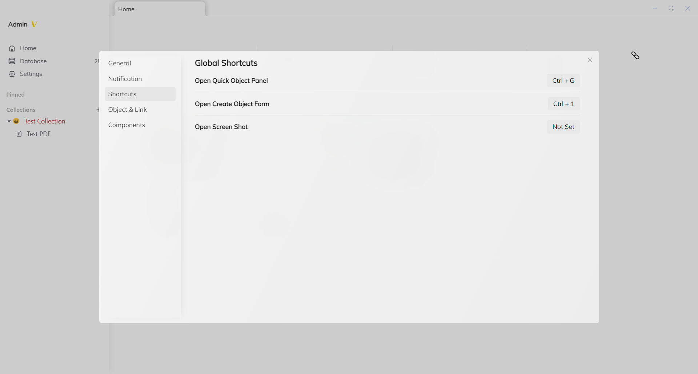
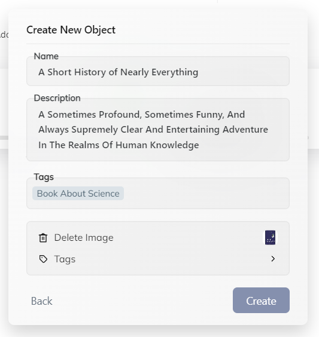

# Core Concepts

## Object
Object is the core and magic of Rendevoz. It integrates Rendevoz's major systems into one, making knowledge management never so convenient and clear.

### Let's generate an object
First, you need to set your shortcut to open create object panel in settings.

Then we use the shortcut to open panel and create our first object: An object about a science book.

