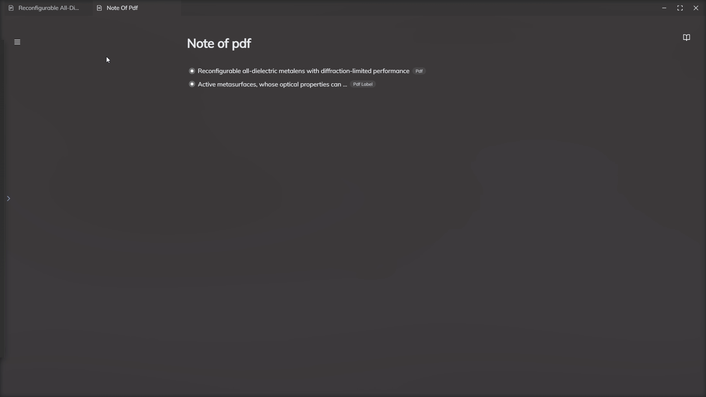

# 核心概念

## 实体
实体是Rendevoz的核心与神奇所在。它将Rendevoz的各大系统结合在一起，使得知识管理从未如此便捷与清晰。

## 什么是实体，我们为什么需要实体？
在学习的过程中我们会遇到各种各样的知识，它们可能是PDF，可能是网页，可能是视频，音频，或者是里面的标注等等，如何将如此庞杂以及形态各异的知识点汇总管理呢？我们就需要对它们进行抽象。

实体就是对于知识的高一层级抽象，我们将各种知识统一为实体并带有属性：**类型，名称，简介，标签，封面图**等。

除此以外，实体还具备更多能力，如：根据属性进行筛选，通过链接与其他实体进行连接，将实体嵌套在实体中，以及复用等等。

通过实体，我们就可以简单轻松完成对于知识的管理，无须考虑知识之间的差异性。

    
    

### 让我们创建第一个实体
首先在侧边栏中打开主页，点击右上角的创建，这里我们以创建PDF为例。

如果您成功看到这个界面，那么输入您想要的信息，再单击创建即可。

创建完成后，您就会自动跳转到PDF界面。现在，我们随机选一段文字进行高亮。

完成高亮以后，我们将其拖动到左侧数据库(database)上，在显示蓝色框后释放鼠标即可完成创建。

### 查看创建的实体
到此为止，您已经成功创建了两个实体，一个为PDF，一个为PDF标注。现在我们进入数据库，查看您刚刚创建的实体。

点击左侧数据库按钮，进入数据库页面。在此页面中会列出您所创建的所有实体，您可以通过强大的筛选功能对其进行筛选，也可以通过排序来查看实体。

*创建的两个实体*

### 点击实体名称即可跳转到对应位置
点击实体标题，即可跳转到对应的位置。

比如点击PDF标注，就可以跳转回其所在的PDF页面并且它会被高亮框起。

### 查看关系图

您可以通过多种方式打开关系图：通过快捷键打开实体面板，点击名称左侧按钮，通过关系图即可打开。其他方式同理。

关系图能够为您展现您所创建的所有实体之间的关系。刚才您通过高亮创建了一个标签实体，那么就会自动添加彼此之间的链接。

## 通过拖拽在不同组件间生成实体
> 拖拽是Rendevoz的核心操作之一，绝大部分实体与链接生成都可以靠拖拽实现，这可以极大的降低您的使用成本。

刚才您通过将高亮拖拽到侧边栏实现了生成实体，但其实在Rendevoz中还有更简单的方式。

现在请您回到主页创建一个笔记。并将其进行分屏。

完成分屏后，请您拖拽刚才生成的高亮到右侧的笔记中。

通过非常简单的拖拽，您就可以将高亮实体放置到笔记中，如果您有兴趣的话可以再次打开关系图，可以看到高亮与笔记实体之间的链接也已被自动添加。同理，您可以通过拖拽到任何组件上生成实体，白板，PDF皆可。

**到此为止，恭喜您已经基本上完成了对于Rendevoz主要操作的全部学习！没错，您只需要通过拖拽，即可完成实体生成，关系添加等操作，无须花费更多学习成本！**