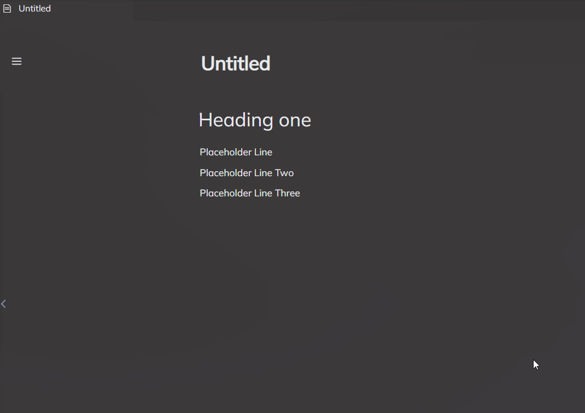
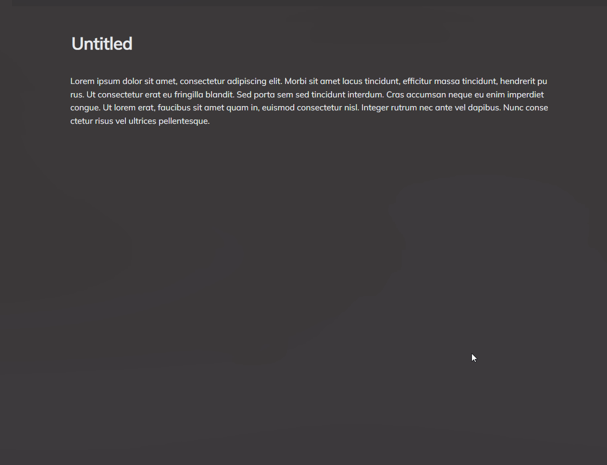
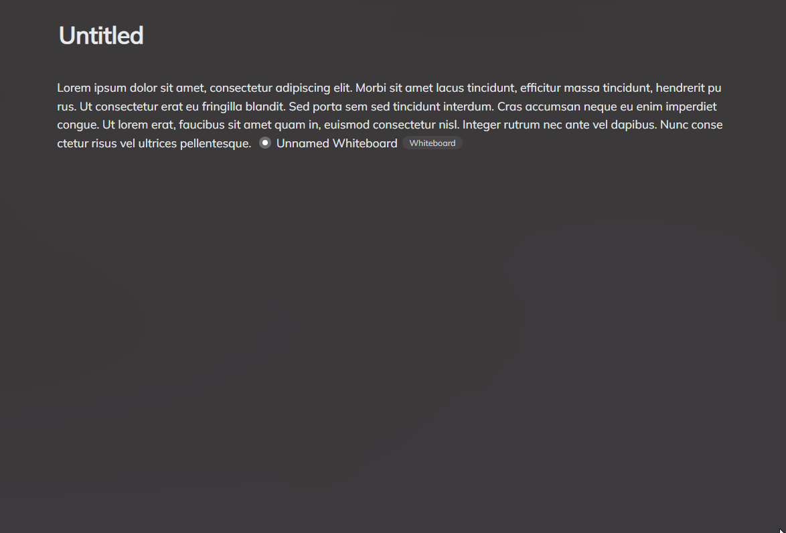
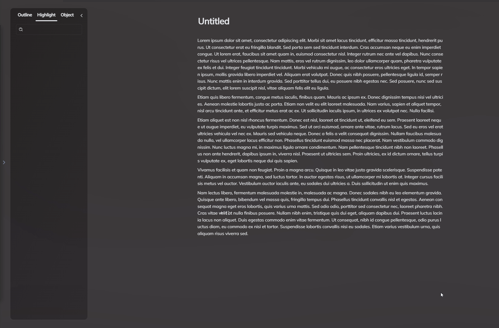
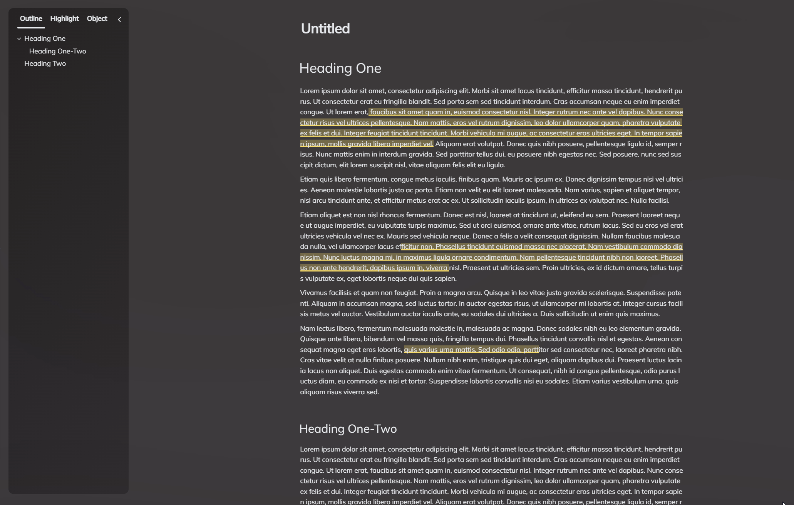
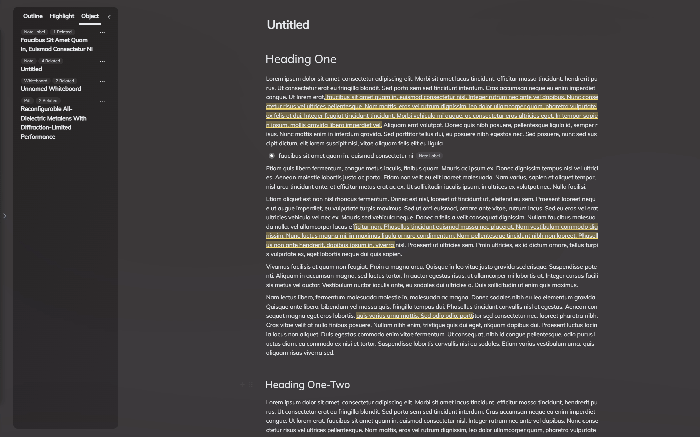

# 块编辑器
块编辑器是Rendeovz中一个非常强大的功能，您可以将传统的笔记记录与新颖的实体功能相结合，借助现代编辑器的强大能力完成对您的想法，思路的记录。

## 拖拽排版以及添加块
您可以将鼠标移到段落上，段落前就会自动出现按钮，点击左侧加号可以在下方添加新块，点击右侧拖拽符号可以修改块的属性，拖拽则可以进行重新排版。

## 将实体添加到笔记中
您有多种方式可以将实体添加到笔记中：

1. 使用斜杠菜单 / 快速将已有的实体添加到笔记中。
2. 使用快捷面板将已有的实体添加到笔记中。
3. 使用分屏，将其他组件中的实体添加到笔记中：如PDF中的高亮拖拽到笔记中。

## 斜杠菜单
您可以通过 / 键快速打开添加块的菜单，通过这种方法您可以将实体快速添加到笔记中。

## 悬浮菜单
您可以通过悬浮菜单对选中的文字进行编辑，悬浮菜单支持撤销和重做，改变字体颜色，大小等功能。

## 高亮
您可以对笔记中的文字进行高亮，在侧边工具栏的高亮标签页中会列出您在本篇笔记中的所有高亮，点击即可跳转到对应高亮位置，并且其背景颜色也会闪烁5秒。

## 高亮生成实体
高亮支持生成实体，拖拽高亮到左侧数据库上即可添加为高亮实体，点击实体即可跳转到笔记对应高亮位置。

## 目录
您可以通过标题来组成目录，在左边工具栏中点击目录即可跳转到对应位置，对应目录会用黄色高亮标注。目录支持折叠。

## 查看笔记中所有实体
您可以通过在左边工具栏中选择实体，点击右上角三个点选择“聚焦”即可跳转到对应位置，对应实体会用黄色高亮标注。

## 阅读模式
您可以点击右上角的书本按钮即可进入阅读模式，阅读模式下会有更好的阅读体验并支持对选中的文字进行翻译，再次点击即可回到编辑模式。

