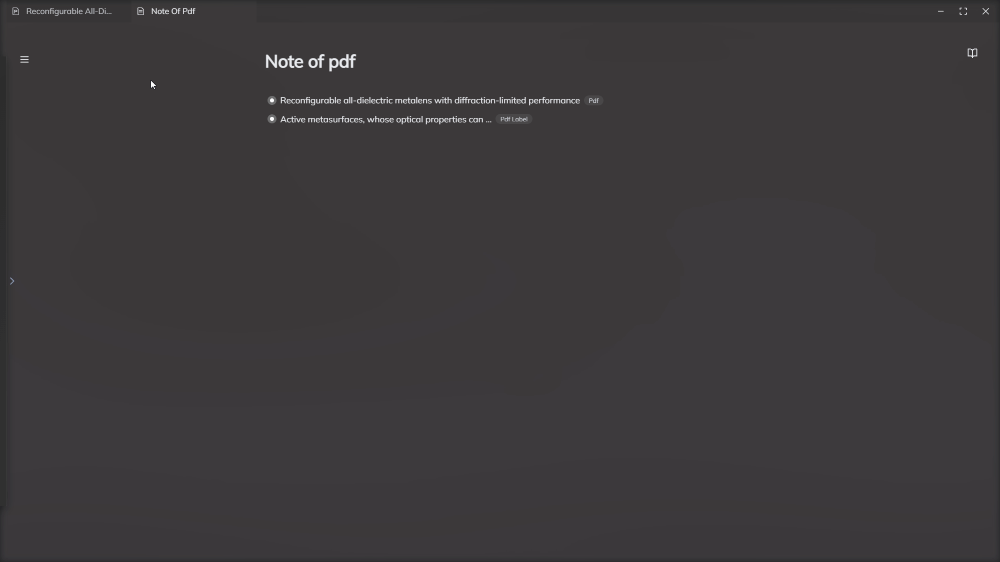
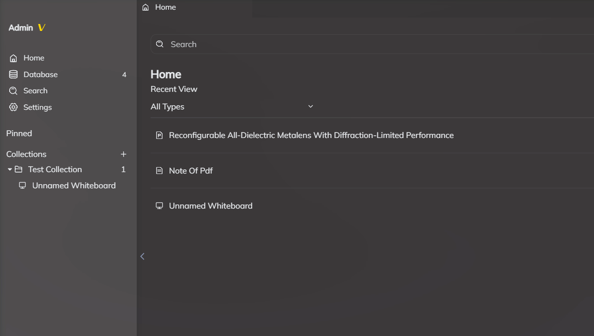

# 基础界面

## 多标签页
在Rendevoz中实现了多标签页的功能，您可以像使用浏览器一样，每打开一个新的文件都会在上方新建一个新的标签页。
您可以拖拽标签页进行重新排列，也可以将其拖拽出来进行分屏。

## 界面主题
您可以在设置中切换黑暗模式，也可以在外观设置中更改壁纸，透明度，模糊度等。

## 主页
主页会展示您最近打开与创建的所有实体。您可以通过搜索，排序来筛选。也可以在这里创建实体。

## 数据库
数据库会展示您所创建的所有实体，这里拥有比主页更加强大的筛选与展示功能，同时也会展示所有的标注实体。

## 侧边栏
侧边栏中有Rendevoz的主要功能，如：主页，数据库，全文搜索，设置，收藏夹等。

## 全文搜索
全文搜索支持搜索您知识库中**PDF，笔记以及网页**的内容，您需要先打开需要搜索的文件才能对其进行搜索。搜索结果为实体以及其中的内容。点击结果即可跳转到对应位置。

## 收藏夹
收藏夹可以放置任何类型的实体，您可以将实体拖拽到收藏夹上即可添加进去。拖拽收藏夹到其他收藏夹上即可改变位置。

点击收藏夹右侧的加号可以添加新收藏夹。