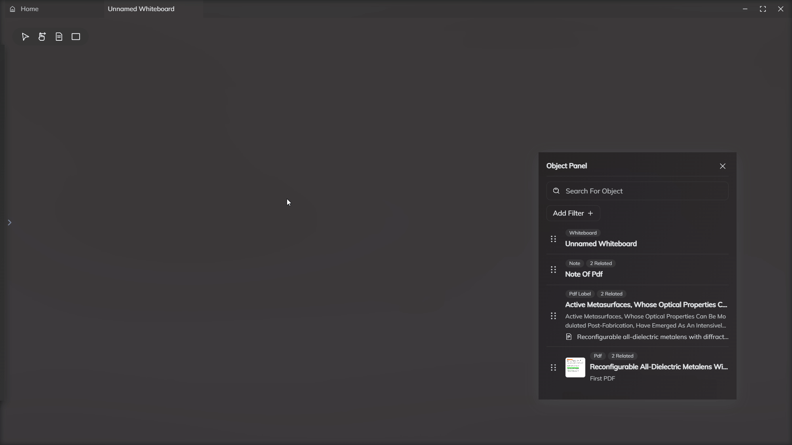
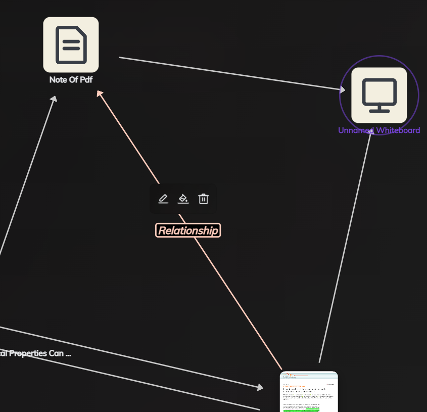

# 实体进阶操作

## 快捷面板
打开设置界面，设置快捷键即可打开快捷面板

## 为实体添加标签
实体的类型代表着对应文件或者知识的类型，不可改变。但是您可以用标签来

## 筛选
您可以通过搜索名称，以及筛选属性来找到目标实体。
支持筛选的属性：创建时间，浏览时间，标签，类型，与某一个实体相关联的所有实体（此方式仅在快捷面板中支持）。

## 拖拽以复用
您可以通过快捷面板直接将实体拖拽到任意组件中进行复用，并且点击实体即可跳转到对于位置。

*将实体快速添加到笔记中*

*将实体快速添加到白板中*

## 关系图

### 关系图的筛选
在关系图中，您也可以通过筛选来获取更多信息。

*关系图中的筛选优先级：钉住 > 鼠标悬浮 > 筛选*

### 修改链接属性以及删除链接
链接支持修改名称以及颜色，您可以通过修改链接的属性来更直观的找到实体之间的联系。

点击垃圾桶即可删除链接。

