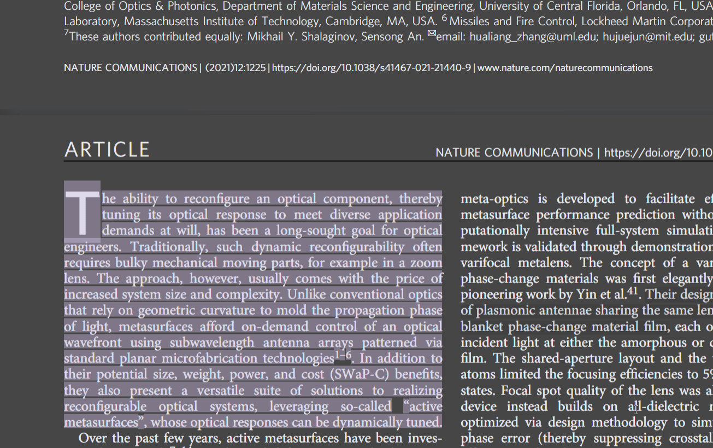
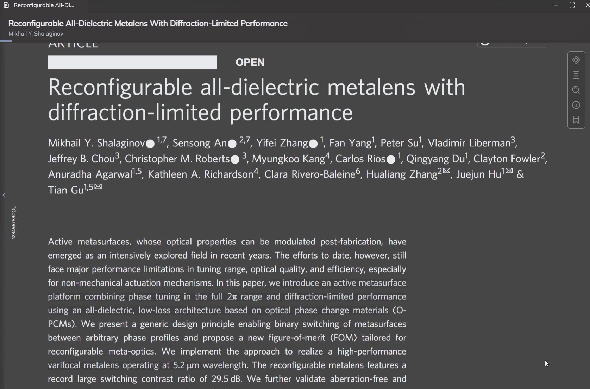

# PDF阅读器

## 基础界面
PDF阅读器由标题栏，内容与工具栏组成。

您可以通过侧边工具栏完成放大，缩小，自动宽度，拖拽，全文搜索等功能。

同时侧边栏中也可以查看自动分析出来的PDF目录，以及您的所有高亮。

## 划段高亮
Rendevoz支持您划段进行高亮，高亮以后的段落不会自动添加为实体，需要您手动添加。

*划词高亮以及生成实体*

## 翻译段落
高亮支持改变背景颜色，翻译选中段落等功能。

*选中段落进行翻译*

## 拖拽实体到PDF中
PDF阅读器支持您将实体拖拽到PDF中，并自动生成链接。

*拖拽实体到PDF中*