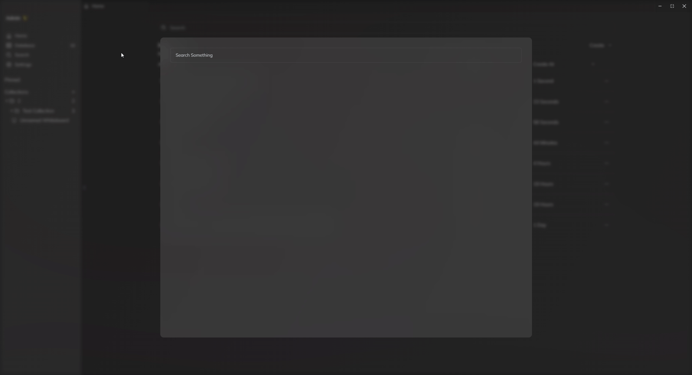

# 键入即搜索您知识库的PDF，笔记以及网页内容

*键入即可立刻搜索到内容，并以直观的形式为您展示结果，一目了然。点击结果即可跳转到对于位置。*

## 键入即搜索
Rendevoz具备强大的全文检索能力，让你在几毫秒内就能够快速检索数万篇文档，支持按相关度排序，错别字容忍，联想搜索，拼音搜索等功能。

## 导入文件
您在创建完实体以后，其内容并不能立刻就被搜索到，您需要先打开实体才能使其能够被搜索。

*网页需要先进入阅读模式才能被搜索到*

## 搜索精度
PDF文件的搜索精度为页，点击以后会跳转到对应页数，并高亮页内所有符合的段落。

笔记和网页的搜索精度为块，点击以后会跳转到对应块并高亮。

