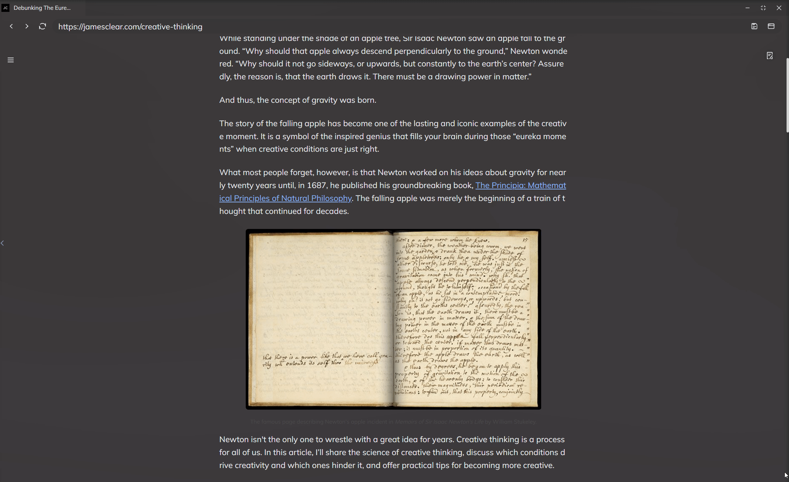

# 网页阅读器

## 创建网页
您有两种方式可以创建一个网页实体，一种是直接通过主页，收藏夹或快捷键创建，另一种是在阅读器内部创建。

## 在阅读器内保存网页为实体
当您的导航栏出现保存图标时，这意味着您可以直接将其保存为实体

*点击最右侧的保存图标即可保存为实体*

## 剪藏并进入阅读模式
点击导航栏最右侧的书本图标即可进入阅读模式，阅读模式会对网页内容进行剪藏并保存（这代表着您能够搜索到网页中的内容）。再次点击此图标可以回到原网页。

## 编辑网页内容或高亮
网页阅读器以块编辑器为底层，这意味着其继承了编辑器强大的功能，您可以进入编辑模式，像修改笔记一样对网页内容进行编辑或高亮。

