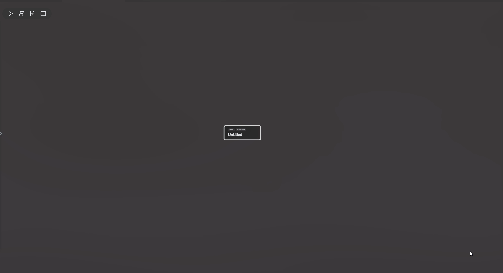
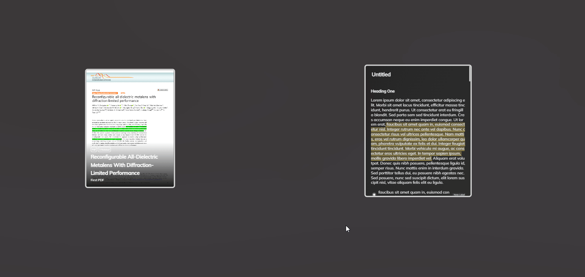

# 白板
白板可以通过可视化的方式更直观的展现不同实体之间的关系。

## 添加元素
在白板中所有的元素（除了卡片）都是实体，您可以像之前一样通过简单的拖拽把实体放置到白板中，除此以外，您还可以把本地的文件拖拽到白板中，如图片，视频，网页等。

*您可以在设置中选择是否自动为拖拽到白板中的实体添加与白板的链接，有时候可能您并不需要为白板添加链接。*

## 多选，以及添加组
点击左上角的光标图标进入框选模式即可多选，多选以后的元素支持添加为组，组在拖动时会带着所有元素一起移动。

点击手势图标可回到拖动模式。

## 在白板中浏览笔记，PDF
您可以双击笔记或者PDF，会在右侧打开此实体的内容。

## 为白板中的元素添加链接，并为链接添加标注
将光标移动到元素边框处便会自动出现链接点，选中链接点，拖动线到另一个元素处即可添加两者之间的链接。

点击链接即可更改链接颜色以及标注。

## 元素自适应字体大小
在白板中字体会根据元素的宽高自动改变大小和位置，您不需要担心字体太小而看不见的问题。

